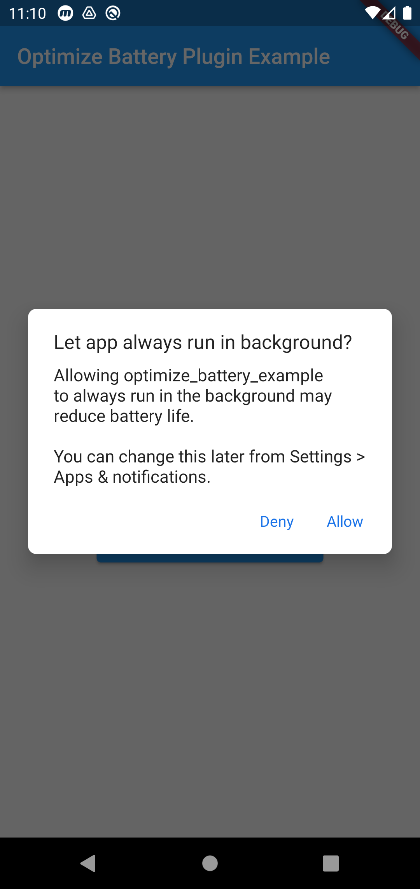

# optimize_battery

Check for application battery optimization status and open settings or disable it

## Getting Started

## Check if app is ignoring battery optimization

``` 
  OptimizeBattery.isIgnoringBatteryOptimizations().then((onValue) {
      setState(() {
          if (onValue) {
              // Igonring Battery Optimization
          } else {
              // App is under battery optimization
          }
      });
  });
```

## Take user to battery optimization settings

```
  OptimizeBattery.openBatteryOptimizationSettings()
```

## Show battery optimization disable dialog

```
  OptimizeBattery.stopOptimizingBatteryUsage();
```

This opens the battery optimization disable dialog.



Add the permission in Mainfest file
```
<uses-permission  android:name="android.permission.REQUEST_IGNORE_BATTERY_OPTIMIZATIONS"/>
```

It uses the intent(```ACTION_REQUEST_IGNORE_BATTERY_OPTIMIZATIONS```). Which is not recommended unless its an excemtion case. Such as the applications main functionality needs the battery optimisation to be disabled.

Read more here : https://developer.android.com/training/monitoring-device-state/doze-standby#exemption-cases

## Credit

This plugin is inspired from [battery_optimization](https://pub.dev/packages/battery_optimization) but with supporting Null safety and Android V2 embedding